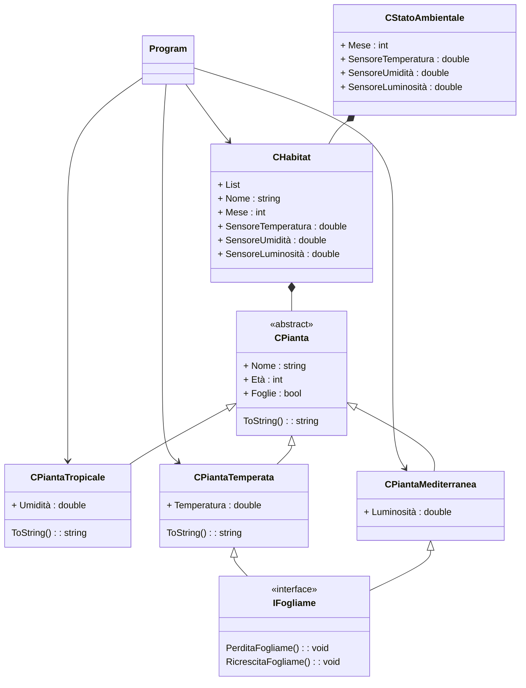

```mermaid
classDiagram

    class CPianta{
        <<abstract>>
        + Nome : string
        + Età : int
        + Foglie : bool

        ToString() : string
    }
    
    class CPiantaTropicale{
        + Umidità : double

        ToString() : string
    }

    class CPiantaTemperata{
        + Temperatura : double

        ToString() : string
    }

    class CPiantaMediterranea {
        + Luminosità : double
    }

    class IFogliame {
        <<interface>>

        PerditaFogliame() : void
        RicrescitaFogliame() : void
    }

    class CHabitat {
        + List<CPianta>
        + Nome : string
        + Mese : int
        + SensoreTemperatura : double
        + SensoreUmidità : double
        + SensoreLuminosità : double
    }

    class CStatoAmbientale {
        + Mese : int
        + SensoreTemperatura : double
        + SensoreUmidità : double
        + SensoreLuminosità : double
    }

    Program --> CHabitat
    Program --> CPiantaTropicale
    Program --> CPiantaTemperata
    Program --> CPiantaMediterranea
    CHabitat *-- CPianta
    CPiantaTemperata <|-- IFogliame
    CPiantaMediterranea <|-- IFogliame
    CPianta <|-- CPiantaTropicale
    CPianta <|-- CPiantaTemperata
    CPianta <|-- CPiantaMediterranea
    CStatoAmbientale *-- CHabitat
```