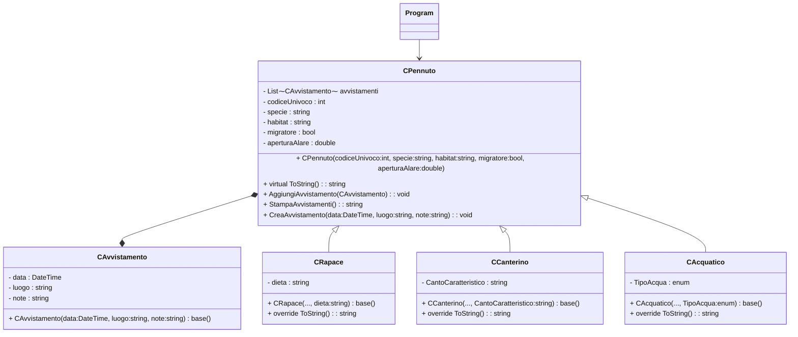

```mermaid
classDiagram

    %% CLASSI PRINCIPALI
    class CPennuto {
        - List⁓CAvvistamento⁓ avvistamenti
        - codiceUnivoco : int
        - specie : string
        - habitat : string
        - migratore : bool
        - aperturaAlare : double

        + CPennuto (codiceUnivoco:int, specie:string, habitat:string, migratore:bool, aperturaAlare:double)
        + virtual ToString() : string
        + AggiungiAvvistamento(CAvvistamento) : void
        + StampaAvvistamenti() : string
        + CreaAvvistamento(data:DateTime, luogo:string, note:string) : void
    }

    class CAvvistamento {
        - data : DateTime
        - luogo : string
        - note : string

        + CAvvistamento(data:DateTime, luogo:string, note:string) : base()
    }

    class CRapace {
        - dieta : string

        + CRapace(..., dieta:string) : base()
        + override ToString() : string
    }

    class CCanterino {
        - CantoCaratteristico : string

        + CCanterino(..., CantoCaratteristico:string) : base()
        + override ToString() : string
    }

    class CAcquatico {
        - TipoAcqua : enum

        + CAcquatico(..., TipoAcqua:enum) : base()
        + override ToString() : string
    }

    %% RELAZIONI

    %% COMPOSIZIONE
    CPennuto *-- *CAvvistamento

    %% EREDITARIETÀ
    CPennuto <|-- CRapace
    CPennuto <|-- CCanterino
    CPennuto <|-- CAcquatico

    %% Program usa le classi ma non le possiede
    Program --> CPennuto
```