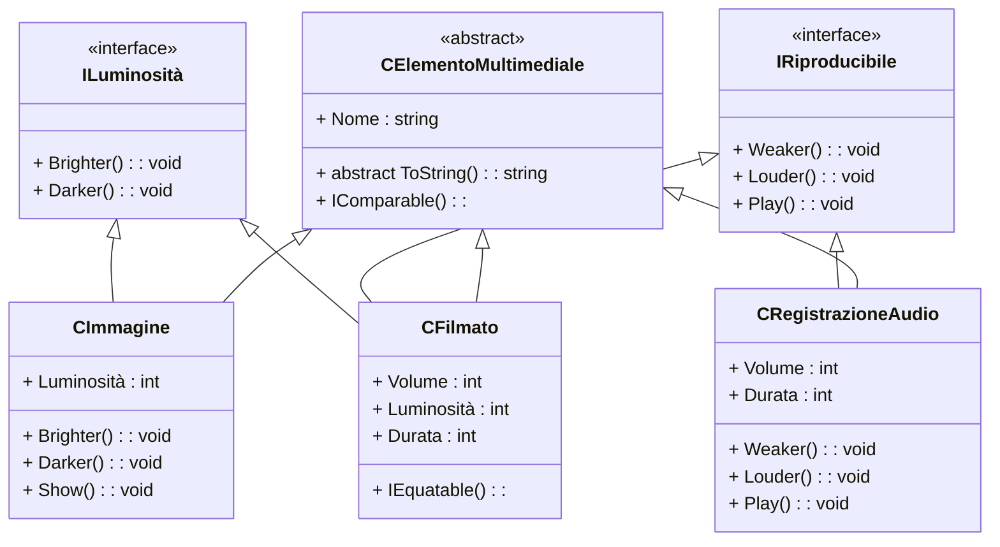

## Diagramma UML esContenutiMultimediali

```mermaid
classDiagram

    class CElementoMultimediale {
        <<abstract>>
        + Nome : string

        + abstract ToString() : string
        + IComparable() : 
    }

    class CRegistrazioneAudio {
        + Volume : int
        + Durata : int

        + Weaker() : void
        + Louder() : void
        + Play() : void
    }

    class CFilmato {
        + Volume : int
        + Luminosità : int
        + Durata : int
        
        + IEquatable() :
    }

    class CImmagine {
        + Luminosità : int

        + Brighter() : void
        + Darker() : void
        + Show() : void
    }

    class IRiproducibile {
        <<interface>>
        + Weaker() : void
        + Louder() : void
        + Play() : void
    }

    class ILuminosità  {
        <<interface>>
        + Brighter() : void
        + Darker() : void
    }

    CElementoMultimediale <|-- CImmagine
    CElementoMultimediale <|-- CRegistrazioneAudio
    CElementoMultimediale <|-- CFilmato

    IRiproducibile <|-- CFilmato
    IRiproducibile <|-- CRegistrazioneAudio
    ILuminosità <|-- CFilmato
    ILuminosità <|-- CImmagine
```