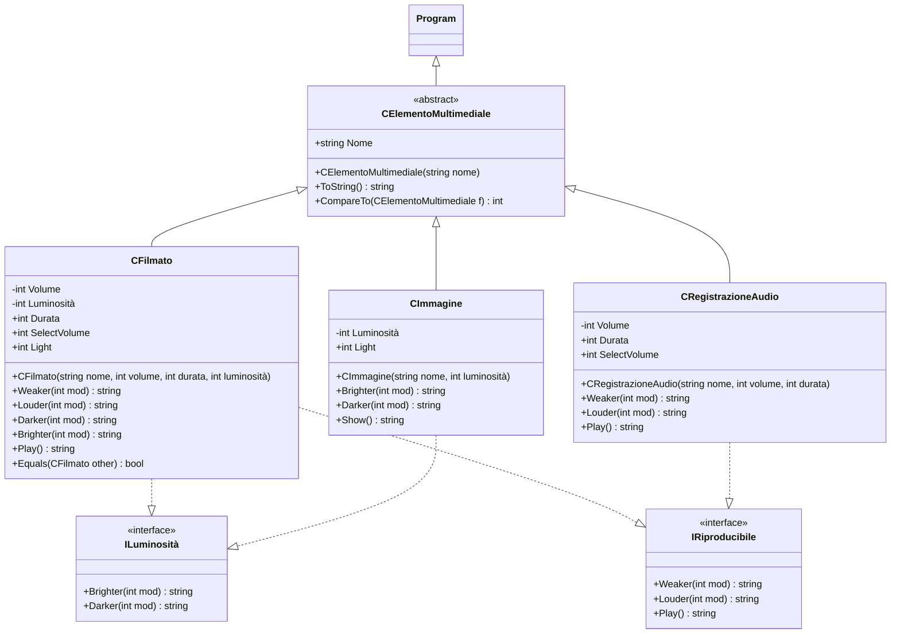

## Diagramma UML - esContenutiMultimediali

Il diagramma rappresenta le classi dei contenuti multimediali e le
interfacce utilizzate per la riproduzione e la regolazione della luminosità.

```mermaid
classDiagram

    class CElementoMultimediale {
        <<abstract>>
        +string Nome

        +CElementoMultimediale(string nome)
        +ToString() string
        +CompareTo(CElementoMultimediale f) int
    }

    class CRegistrazioneAudio {
        -int Volume
        +int Durata
        +int SelectVolume

        +CRegistrazioneAudio(string nome, int volume, int durata)
        +Weaker(int mod) string
        +Louder(int mod) string
        +Play() string
    }

    class CFilmato {
        -int Volume
        -int Luminosità
        +int Durata
        +int SelectVolume
        +int Light

        +CFilmato(string nome, int volume, int durata, int luminosità)
        +Weaker(int mod) string
        +Louder(int mod) string
        +Darker(int mod) string
        +Brighter(int mod) string
        +Play() string
        +Equals(CFilmato other) bool
    }

    class CImmagine {
        -int Luminosità
        +int Light

        +CImmagine(string nome, int luminosità)
        +Brighter(int mod) string
        +Darker(int mod) string
        +Show() string
    }

    class IRiproducibile {
        <<interface>>
        +Weaker(int mod) string
        +Louder(int mod) string
        +Play() string
    }

    class ILuminosità {
        <<interface>>
        +Brighter(int mod) string
        +Darker(int mod) string
    }

    Program <|-- CElementoMultimediale

    CElementoMultimediale <|-- CImmagine
    CElementoMultimediale <|-- CRegistrazioneAudio
    CElementoMultimediale <|-- CFilmato

    CFilmato ..|> IRiproducibile
    CRegistrazioneAudio ..|> IRiproducibile
    CFilmato ..|> ILuminosità
    CImmagine ..|> ILuminosità
```