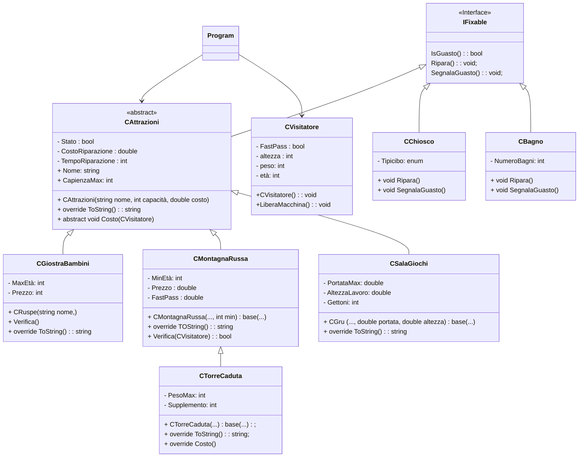

```mermaid
classDiagram
    %% Lista di Interfacce
    %% CLASSI PRINCIPALI
    class CAttrazioni {
        <<abstract>>
        - Stato : bool
        - CostoRiparazione : double
        - TempoRiparazione : int
        + Nome: string
        + CapienzaMax: int

        + CAttrazioni(string nome, int capacità, double costo)
        + override ToString() : string
        + abstract void Costo(CVisitatore)
    }

    class CGiostraBambini {
        - MaxEtà: int
        - Prezzo: int

        + CRuspe (string nome, )
        + Verifica()
        + override ToString() : string
    }

    class CSalaGiochi {
        - PortataMax: double
        - AltezzaLavoro: double
        - Gettoni: int

        + CGru (..., double portata, double altezza) : base(...)
        + override ToString() : string
    }

    class CMontagnaRussa {
        - MinEtà: int
        - Prezzo : double
        - FastPass : double

        + CMontagnaRussa(..., int min) : base(...)
        + override TOString() : string
        + Verifica(CVisitatore) : bool
    }

    class CTorreCaduta {
        - PesoMax: int
        - Supplemento: int

        + CTorreCaduta(...) : base (...) ;
        + override ToString(): string;
        + override Costo()
    }

    class CVisitatore{
        - FastPass : bool
        - altezza : int
        - peso: int
        - età: int

        +CVisitatore(): void
        +LiberaMacchina(): void
    }

    class IFixable {
        <<Interface>>
        IsGuasto(): bool

        Ripara() : void;
        SegnalaGuasto() : void;
    }

    class CChiosco{
        - Tipicibo: enum
        
        + void Ripara()
        + void SegnalaGuasto() 
    }

    class CBagno{
        - NumeroBagni: int

        + void Ripara()
        + void SegnalaGuasto() 
    }

    %% EREDITARIETÀ
    IFixable <|-- CAttrazioni
    IFixable <|-- CChiosco
    IFixable <|-- CBagno
    CAttrazioni <|-- CGiostraBambini
    CAttrazioni <|-- CMontagnaRussa
    CAttrazioni <|-- CSalaGiochi
    CMontagnaRussa <|-- CTorreCaduta

    %% Program usa le classi ma non le possiede
    Program --> CAttrazioni
    Program --> CVisitatore
```