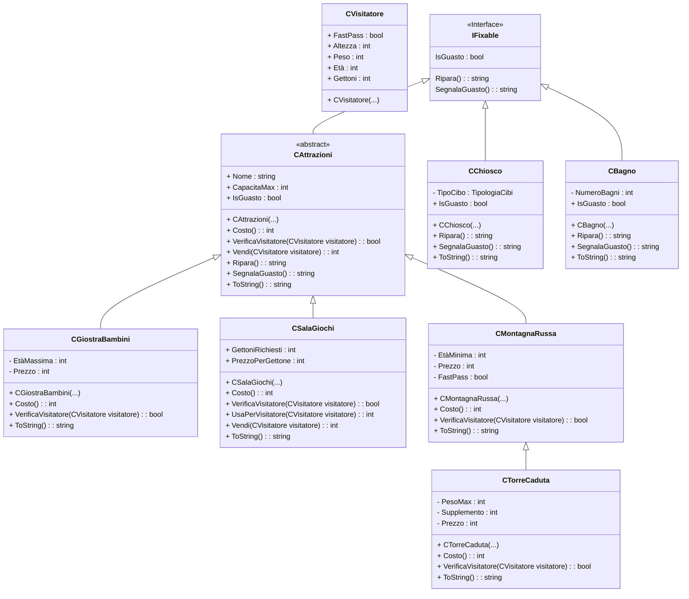

```mermaid
classDiagram
    class CAttrazioni {
        <<abstract>>
        + Nome : string
        + CapacitaMax : int
        + IsGuasto : bool
        + CAttrazioni(...)
        + Costo() : int
        + VerificaVisitatore(CVisitatore visitatore) : bool
        + Vendi(CVisitatore visitatore) : int
        + Ripara() : string
        + SegnalaGuasto() : string
        + ToString() : string
    }

    class CGiostraBambini {
        - EtàMassima : int
        - Prezzo : int
        + CGiostraBambini(...)
        + Costo() : int
        + VerificaVisitatore(CVisitatore visitatore) : bool
        + ToString() : string
    }

    class CSalaGiochi {
        + GettoniRichiesti : int
        + PrezzoPerGettone : int
        + CSalaGiochi(...)
        + Costo() : int
        + VerificaVisitatore(CVisitatore visitatore) : bool
        + UsaPerVisitatore(CVisitatore visitatore) : int
        + Vendi(CVisitatore visitatore) : int
        + ToString() : string
    }

    class CMontagnaRussa {
        - EtàMinima : int
        - Prezzo : int
        - FastPass : bool
        + CMontagnaRussa(...)
        + Costo() : int
        + VerificaVisitatore(CVisitatore visitatore) : bool
        + ToString() : string
    }

    class CTorreCaduta {
        - PesoMax : int
        - Supplemento : int
        - Prezzo : int
        + CTorreCaduta(...)
        + Costo() : int
        + VerificaVisitatore(CVisitatore visitatore) : bool
        + ToString() : string
    }

    class CVisitatore{
        + FastPass : bool
        + Altezza : int
        + Peso : int
        + Età : int
        + Gettoni : int
        + CVisitatore(...)
    }

    class IFixable {
        <<Interface>>
        IsGuasto : bool
        Ripara() : string
        SegnalaGuasto() : string
    }

    class CChiosco {
        - TipoCibo : TipologiaCibi
        + IsGuasto : bool
        + CChiosco(...)
        + Ripara() : string
        + SegnalaGuasto() : string
        + ToString() : string
    }

    class CBagno {
        - NumeroBagni : int
        + IsGuasto : bool
        + CBagno(...)
        + Ripara() : string
        + SegnalaGuasto() : string
        + ToString() : string
    }

    IFixable <|-- CAttrazioni
    IFixable <|-- CChiosco
    IFixable <|-- CBagno
    CAttrazioni <|-- CGiostraBambini
    CAttrazioni <|-- CMontagnaRussa
    CAttrazioni <|-- CSalaGiochi
    CMontagnaRussa <|-- CTorreCaduta
```