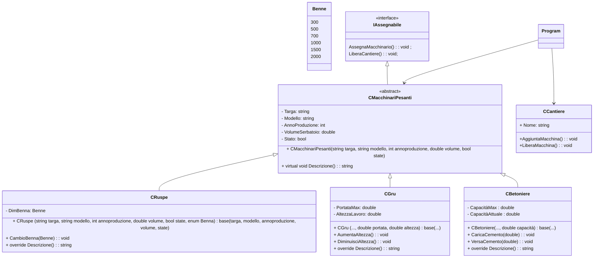

```mermaid
classDiagram

    %% CLASSI PRINCIPALI
    class CMacchinariPesanti {
        <<abstract>>
        - Targa: string
        - Modello: string
        - AnnoProduzione: int
        - VolumeSerbatoio: double
        - Stato: bool

        + CMacchinariPesanti(string targa, string modello, int annoproduzione, double volume, bool state)
        + virtual void Descrizione() : string
    }

    class Benne {
        300
        500
        700
        1000
        1500
        2000
    }

    class CRuspe {
        - DimBenna: Benne

        + CRuspe (string targa, string modello, int annoproduzione, double volume, bool state, enum Benna) : base(targa, modello, annoproduzione, volume, state)
        + CambioBenna(Benne) : void
        + override Descrizione() : string
    }

    class CGru {
        - PortataMax: double
        - AltezzaLavoro: double

        + CGru (..., double portata, double altezza) : base(...)
        + AumentaAltezza() : void
        + DiminuisciAltezza() : void
        + override Descrizione() : string
    }

    class CBetoniere {
        - CapacitàMax : double
        - CapacitàAttuale : double

        + CBetoniere(..., double capacità) : base(...)
        + CaricaCemento(double) : void
        + VersaCemento(double) : void 
        + override Descrizione() : string
    }

    class IAssegnabile {
        <<interface>>
        AssegnaMacchinario() : void ;
        LiberaCantiere() : void;
    }

    class CCantiere{
        + Nome: string

        +AggiuntaMacchina(): void
        +LiberaMacchina(): void
    }

    %% EREDITARIETÀ
    IAssegnabile <|-- CMacchinariPesanti
    CMacchinariPesanti <|-- CRuspe
    CMacchinariPesanti <|-- CGru
    CMacchinariPesanti <|-- CBetoniere

    %% Program usa le classi ma non le possiede
    Program --> CMacchinariPesanti
    Program --> CCantiere
```