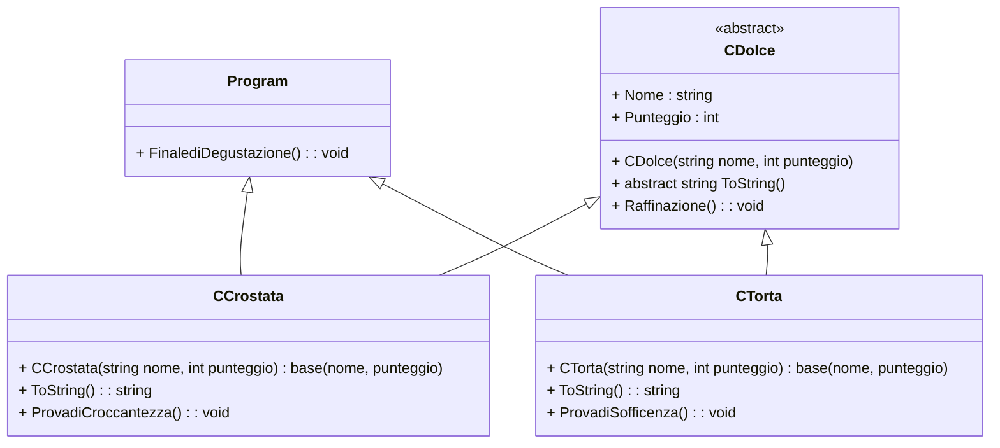

## Diagramma UML esTorte

```mermaid
classDiagram
    class Program{
        + FinalediDegustazione() : void
    }

    class CDolce {
        <<abstract>>
        + Nome : string
        + Punteggio : int

        + CDolce(string nome, int punteggio)
        + abstract string ToString()
        + Raffinazione() : void
    }

    class CCrostata{
        + CCrostata(string nome, int punteggio) : base (nome, punteggio)
        + ToString() : string
        + ProvadiCroccantezza() : void
    }

    class CTorta {
        + CTorta(string nome, int punteggio) : base (nome, punteggio)
        + ToString() : string
        + ProvadiSofficenza() : void
    }

    Program <|-- CCrostata
    Program <|-- CTorta
    CDolce <|-- CCrostata
    CDolce <|-- CTorta
```